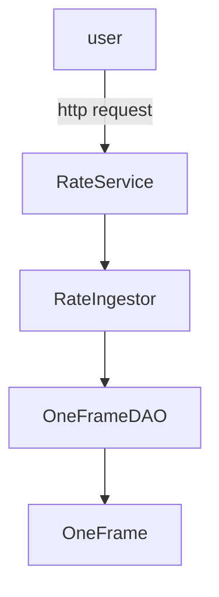

# Forex

Forex is a proxy for [one-frame](https://hub.docker.com/r/paidyinc/one-frame). 
You can get new exchange rates without the request limitation.

## Idea introduction

- `RateService` call `RateIngestor` to get rates
- `RateIngestor` call `OneFrameDAO` to get rates and cache rates periodically

## Run locally
1. start `one-frame` service in 8080 locally
```docker
docker run -p 8080:8080 paidyinc/one-frame
```
2. run `forex` service
```sbt
sbt run
```

## Test
```sbt
sbt validate
```

Integration tests uses docker. If you are using M1 chip and met error `could not load FFI provider jnr.ffi.provider.jffi.Provider`
Please try
```bash
brew install socat
socat TCP-LISTEN:2375,reuseaddr,fork UNIX-CONNECT:/var/run/docker.sock &
export DOCKER_HOST=http://127.0.0.1:2375
```